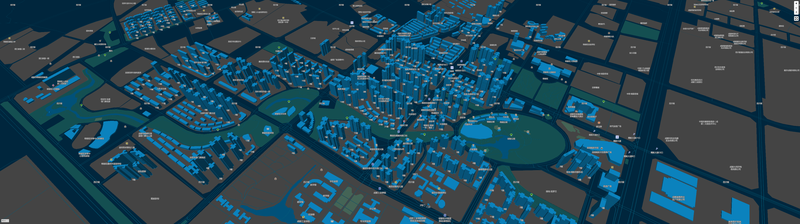
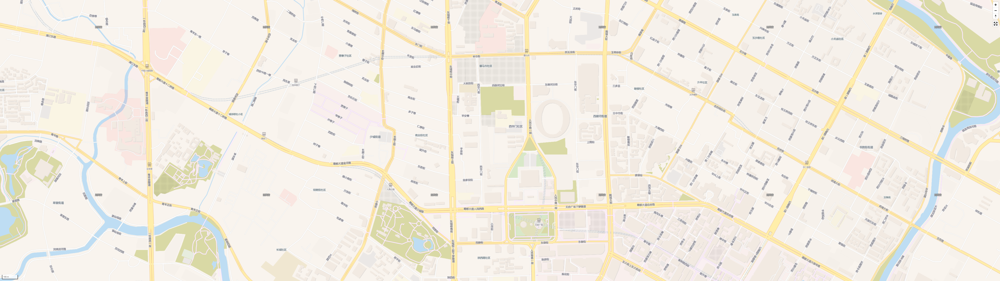

# map-offline-server


Map offline server with java(JDK 21).  
本项目旨在提供离线地图服务，为私有化地图部署提供解决方案。  
项目主要支持mbtiles、tpk格式的地图数据，其他支持的数据格式如下所示，其他的需要转换成mbtiles后使用。  
项目启动后可以通过 http://localhost:10101/ 查看系统页面。

## 特性列表

|           |      mbtiles       |        tpk         |       osm.pbf       |   OSMB(geojson)    |          osm.poi          |
|:---------:|:------------------:|:------------------:|:------------------:|:------------------:|:-------------------------:|
|   底图切片    | :white_check_mark: | :white_check_mark: |                    |                    |                           |
|   地理逆编码   |                    |                    |                    | :white_check_mark: |                           |
|   路径规划    |                    |                    | :white_check_mark: |                    |                           |
|   POI搜索   |                   |                    |                    |                    |   :white_check_mark:      |
|   静态地图    |     :running:      |                    |                    |                    |                           |
| 行政区划（含边界） |                    |                    |                    | :white_check_mark: |                           |

1. 支持离线瓦片服务，主要用于Map服务器离线场景，也支持mvt（pbf）瓦片数据的元数据查看；
2. 支持全球行政区划级联数据查询，也支持对应行政区划边界数据查询，查询时支持国际化，支持简易地理逆编码；
3. 支持离线POI搜索能力（数据获取请访问[POI](https://github.com/qmjy/poi)）；
4. 支持静态资源HTTP服务器能力；
5. 支持工具能力：shapefile转geojson，支持mbtiles合并；
6. 支持图片像素坐标到地理经纬度坐标的地理信息校准（图片投影到地图上）；
7. 新增地图工具：获取中心点坐标，瓦片网格等；

其他定制需求可通过提交[issue](https://github.com/qmjy/mapbox-offline-server/issues)，欢迎反馈。

## 安装启动程序

假设您已经安装完成git、JDK21、Maven程序并设置好了环境变量。

```bash
git clone git@github.com:qmjy/mapbox-offline-server.git
```

进入到代码目录执行命令编码源码：

```bash
cd mapbox-offline-server
mvn clean package
```

进入编译结果目录并启动程序

```bash
cd target
java -jar mapbox-offline-server-xxx.jar --dataPath="your data path"
```

## 资源结构

> 本项目自带了WGS84(WKID=4326)、CGCS2000(WKID=4490)坐标系的Mapbox资源文件。

- 行政区划服务相关需需要包含一种资源文件：geojson；
- 在运行本服务之前需要按照如下结构配置数据目录，然后通过“--dataPath=xxx”的方式启动服务；
- mapbox最新版本不支持离线，可以使用[Maplibre](https://maplibre.org/)代替；

```bash
data
├─assets
│      mapbox-gl.css
│      mapbox-gl.js
├─fonts
│  └─Arial Regular
│         0-255.pbf
│         15616-15871.pbf
│         15872-16127.pbf
├─sprites
│  └─streets
│         sprite.json
│         sprite.png
│         sprite@2x.json
│         sprite@2x.png
├─styles
│      world.json
├─poi
│      xxx.osm.poi
├─osm.pbf
│      Chengdu.osm.pbf
├─tilesets
│      Chengdu.mbtiles
└─OSMB
       China.geojson
```

## 资源

### 地图瓦片数据（mbtiles）

- 四川省-240818: https://cloud.189.cn/web/share?code=VrmEFbiQRn6n（访问码：qzv1）  
- 广西省-241025: https://cloud.189.cn/web/share?code=jERjmaNFNRVv（访问码：6ye6）  
- 中国-240127: https://cloud.189.cn/web/share?code=qaqi227NnAJj（访问码：5xyc）  

其他全球地图支持定制，需要可提交issue。

### 地图主题风格

参考：https://github.com/teamapps-org/maplibre-gl-styles

#### 自定义颜色


#### VersaTiles风格



### 资源下载

数据获取可通过[issue](https://github.com/qmjy/mapbox-offline-server/issues)反馈需求并留下联系方式，已经支持的数据服务地址，请参考[WIKI](https://github.com/qmjy/mapbox-offline-server/wiki)介绍。

### 社交媒体
QQ群：[1005408393](https://qm.qq.com/q/12A9qSA33U)